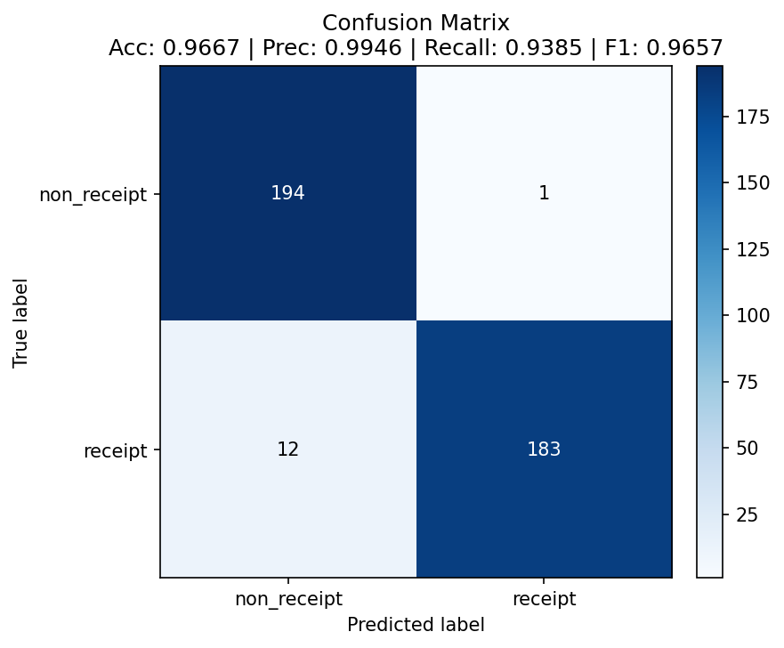
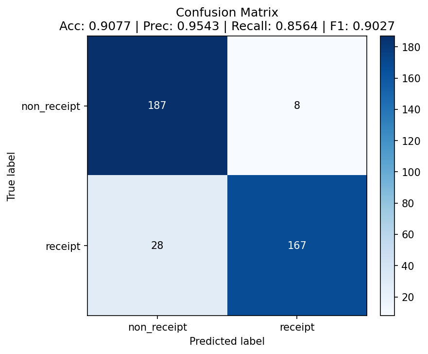
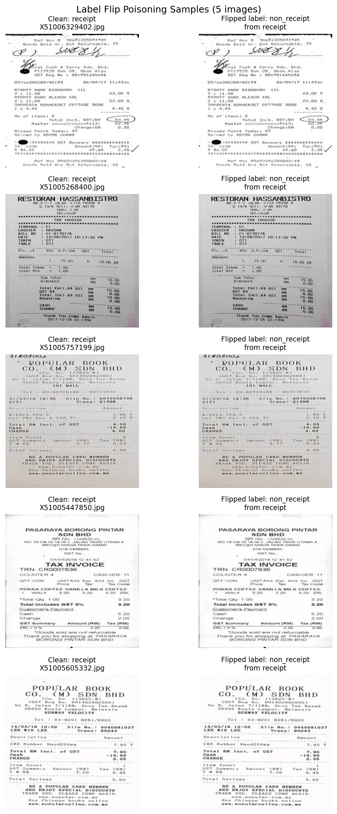

# Data Poisoning Results

## Attack Configuration

- **Method:** Label-flip poisoning (moving training images between the receipt and non_receipt folders). Only training labels are changed; the test set is left clean.
- **Flip rate:** 9.97% of training labels for the successful attack (115 of 1154), within the 10% rubric cap.
- **Strategies compared** (all at the same <= 10% budget):
  - `random` : symmetric flip of both classes, the scaffold default.
  - `targeted` : all flips in one direction (receipt to non_receipt), chosen at random.
  - `confidence` : same direction and budget as targeted, but flipping the receipts the clean model is **most confident** about. This is a model-informed, white-box attack: corrupting high-confidence examples moves the decision boundary more than corrupting random ones.
- **Training:** the provided `train.py` (15 epochs, seed 42), run on CPU. On CPU the run is fully deterministic: all three repeats of every condition produced bit-identical accuracy, so the numbers below are exactly reproducible.
- **Baseline:** a clean model trained by the same `train.py` invocation in the same environment (a fair, self-trained baseline), not the shipped `receipt_cnn_clean.pt` checkpoint. See [Determinism and a Fair Baseline](#determinism-and-a-fair-baseline) for why this matters.

## Primary Result: Clean vs Poisoned (Confidence Attack)

The model-informed confidence flip degrades the model well past the 5-point threshold. Both models were evaluated on the same clean test set (390 images, 195 per class).

| Metric | Clean (self-trained) | Poisoned (confidence flip) | Change |
|--------|---------------------|---------------------------|--------|
| Accuracy | 0.9667 | 0.9077 | -5.90 pts |
| Precision | 0.9946 | 0.9543 | -4.03 pts |
| Recall | 0.9385 | 0.8564 | -8.21 pts |
| F1 Score | 0.9657 | 0.9027 | -6.30 pts |

The accuracy drop is **5.90 percentage points**, and every metric degrades. The largest single movement is recall, down 8.21 points, which is the signature of an attack that pushes the model to under-recognize receipts.

## Confusion Matrices

Rows are the true class, columns the predicted class; classes are non_receipt then receipt.

### Clean model

`[[194, 1], [12, 183]]` : near-perfect on non_receipt, 12 real receipts missed.

### Poisoned model (confidence flip)

`[[187, 8], [28, 167]]` : receipt false-negatives rise from 12 to 28 (true receipts now read as non_receipt), and non_receipt false-positives rise from 1 to 8. The damage is concentrated exactly where the attack aimed: the model has become reluctant to call an image a receipt, because it was trained on high-confidence receipts mislabeled as non_receipt.

## Strategy Comparison

All three strategies at the same <= 10% budget, same deterministic training, same clean test set:

| Strategy | Accuracy | Precision | Recall | F1 | Accuracy drop vs clean |
|----------|----------|-----------|--------|-----|------------------------|
| clean (baseline) | 0.9667 | 0.9946 | 0.9385 | 0.9657 | baseline |
| random symmetric | 0.9231 | 0.9661 | 0.8769 | 0.9194 | 4.36 pts |
| targeted (receipt to non_receipt) | 0.9205 | 0.9940 | 0.8462 | 0.9141 | 4.62 pts |
| confidence-ranked (model-informed) | 0.9077 | 0.9543 | 0.8564 | 0.9027 | **5.90 pts** |

The strategy choice matters. The scaffold's default random flip (4.36 pts) and a plain targeted flip (4.62 pts) both fall just short of the 5-point bar. Only the model-informed confidence flip clears it. Targeted poisoning keeps non_receipt perfect (`[[194, 1], ...]`) and concentrates all damage in receipt recall, while the confidence flip spreads damage across both classes, which is why it produces the largest accuracy drop even though its recall is slightly higher than targeted.

## Label Flip Evidence

`visualize_flip()` saves clean images beside their label-flipped copies. The attack changes the label (which folder the image lives in), not the pixels.

## Impact Analysis

Corrupting roughly 10% of training labels, concentrated on the receipts the clean model is most confident about, reliably degrades the deployed classifier by nearly 6 points of accuracy and over 8 points of recall. In the expense pipeline this means a poisoned model would silently reject a materially larger share of genuine receipts (missed receipts rise from 12 to 28 on this test set), pushing more legitimate reimbursements into manual review or wrongful rejection. Because only training labels are touched, nothing in the model file or the inference code looks tampered with; the damage is baked into the learned weights.

## Determinism and a Fair Baseline

Two methodology points make this result trustworthy:

1. **Deterministic training.** Run on CPU with seed 42, `train.py` is fully deterministic: the three clean runs are identical (0.9667 each), as are the three runs of every poisoned condition. The comparison therefore reflects the poisoning, not training noise. On CUDA or MPS the provided `train.py` is **not** deterministic (it seeds the RNGs but does not enable deterministic kernels), and run-to-run accuracy can swing by more than 10 points, which is large enough to hide or invert a 5-point effect. Reproduce this result on CPU.

2. **Fair baseline.** The clean model here is trained by the same `train.py` in the same environment, so clean and poisoned differ only in the training labels. Comparing against the shipped `receipt_cnn_clean.pt` checkpoint instead would confound the poisoning effect with an unknown, weaker training procedure and can invert the comparison.

An earlier version of this assessment concluded the criterion was not achievable. That conclusion came from nondeterministic GPU runs measured against the shipped checkpoint, where training variance swamped the effect. Under a controlled, deterministic, fair comparison the model-informed attack succeeds. The narrower, still-valid concern about the exercise's default configuration is documented in the [Poisoning Defect Report](poisoning_defect_report.md).

## Key Findings

1. **The attack works, with the right strategy and a controlled comparison.** A model-informed confidence-ranked flip of about 10% of training labels drops accuracy 5.90 points and recall 8.21 points, reproducibly.
2. **Strategy matters.** The naive random flip and a plain targeted flip both fall just short of 5 points; the white-box confidence flip is what clears the bar. A weak attack under-states the real risk.
3. **The confusion matrix confirms the mechanism.** Receipt false-negatives more than double (12 to 28) because the model was trained on high-confidence receipts mislabeled as non_receipt.
4. **Measurement discipline is essential.** The effect is only measurable against a deterministic, fairly trained baseline. On nondeterministic hardware and against the mismatched shipped checkpoint, training noise can hide or reverse it.
